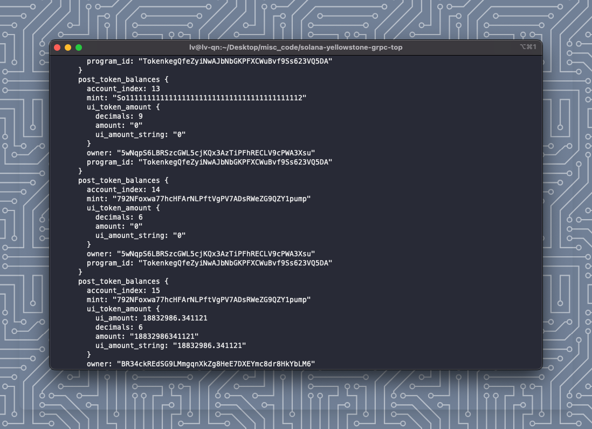

# Solana Yellowstone gRPC Token Monitor



This project is a Python script designed to monitor Solana blockchain transactions for specific tokens using the Yellowstone gRPC service. It logs detailed information about each transaction involving the specified tokens.

## Features

- Monitors transactions for a list of specified token addresses.
- Logs transaction details including signatures, slot numbers, account keys, instructions, fees, balances, token balances, log messages, and rewards.
- Uses a secure gRPC connection to interact with the Solana blockchain.

## Setup

### Prerequisites

- Python 3.7 or higher
- `grpcio` and `grpcio-tools` for gRPC support
- `base58` for encoding/decoding
- `asyncio` for asynchronous operations

### Installation

1. **Clone the Repository**

   ```bash
   git clone https://github.com/yourusername/solana-yellowstone-grpc-top.git
   cd solana-yellowstone-grpc-top
   ```

2. **Set Up a Virtual Environment**

   It's recommended to use a virtual environment to manage dependencies. Run the following commands:

   ```bash
   python3 -m venv venv
   source venv/bin/activate  # On Windows use `venv\Scripts\activate`
   ```

3. **Install Dependencies**

   Use `pip` to install the required Python packages:

   ```bash
   python -m pip install -r requirements.txt
   ```

4. **Create Configuration File**

   Create a `config.json` file in the project directory with the following structure:

   ```json
   {
       "rpc_url": "https://your-rpc-url",
       "auth_token": "your-auth-token",
       "token_addresses": {
           "1000BEER": "AujTJJ7aMS8LDo3bFzoyXDwT3jBALUbu4VZhzZdTZLmG",
           "1000BONK": "DezXAZ8z7PnrnRJjz3wXBoRgixCa6xjnB7YaB1pPB263",
           "BENDOG": "AHW5N8iqZobTcBepkSJzZ61XtAuSzBDcpxtrLG6KUKPk",
           "USDT": "Es9vMFrzaCERmJfrF4H2FYD4KCoNkY11McCe8BenwNYB",
           "WSOL": "So11111111111111111111111111111111111111112"
       }
   }
   ```

   Replace the placeholders with your actual RPC URL, authentication token, and token addresses.

### Usage

Run the script using Python:

```bash
python main.py
```

The script will start monitoring transactions and log detailed information about each transaction involving the specified tokens.

## Data Structure

The script logs the following data for each transaction:

- **Transaction Signature**: A unique identifier for the transaction.
- **Slot**: The block height at which the transaction was processed.
- **Account Keys**: Public keys involved in the transaction.
- **Instructions**: Details of each instruction, including program ID, accounts, and data.
- **Transaction Fee**: The fee paid for the transaction.
- **Pre and Post Balances**: Balances of accounts before and after the transaction.
- **Pre and Post Token Balances**: Token balances before and after the transaction.
- **Log Messages**: Messages generated during transaction execution.
- **Rewards**: Rewards associated with the transaction, including pubkey, lamports, post balance, and reward type.
- **Compute Units Consumed**: The compute units consumed by the transaction.

## Contributing

Contributions are welcome! Please fork the repository and submit a pull request for any improvements or bug fixes.
